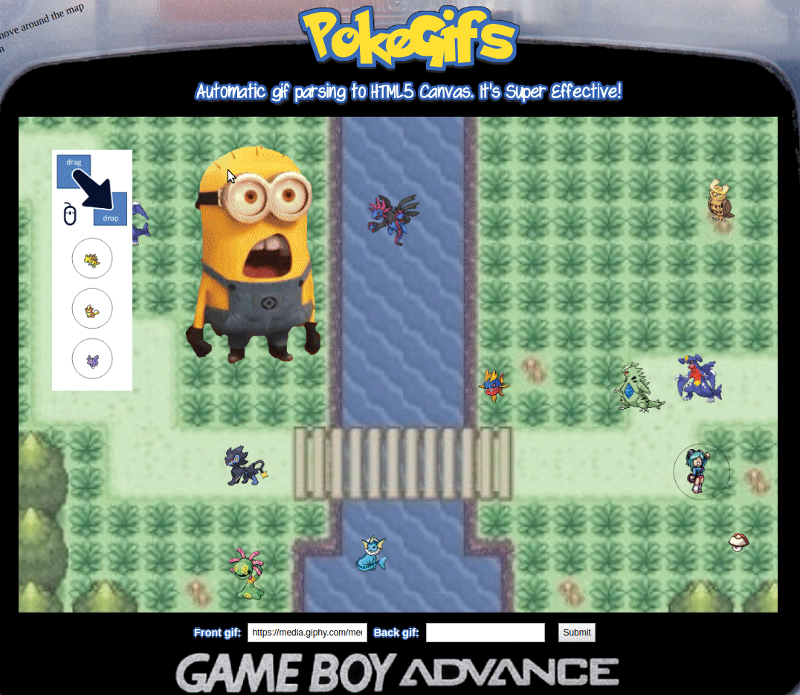

### Check out the [Live Site](https://pokeroyale.herokuapp.com/)!

# Background and Overview

#### A Pokemon-themed framework showcasing how gifs can be rendered to HTML5 Canvas despite gifs "officially" being unsupported

PokeGifs was initially envisioned as a real-time strategy game where circles represent pokemon and their types are represented by the circle colour (primary type) and the circle border colour (secondary type). Players are given a countdown timer with the objective of eliminating all opponent pokemon on the map before the timer runs out. As in the traditional game pokemon type combinations would determine whether an attacker recieves a buff or debuff when squaring off against an enemy. This game was meant to work solely with simple canvas graphics, however I became curious as to how difficult adding proper Pokemon [sprites](https://en.wikipedia.org/wiki/Sprite_(computer_graphics)) would be.

The normal way to get a sprite to animate on a [HTML5 Canvas](https://www.w3schools.com/html/html5_canvas.asp) is to manually create a [spritesheet](https://www.codeandweb.com/what-is-a-sprite-sheet) and then run your frames from this image files to create an animated sprite. This is fine for small-scale projects but is tedious when you have multiple sprites all of differing dimensions (like, for instance, 1000+ Pokemon). Sprite gifs for each Pokemon are easily obtainable. The thought thus arose to simply use the gifs directly. Sadly, HTML5 Canvas does not support gifs at all. One way around this would be to render the gifs in seperate img tags and then to overlay them on top of the canvas using CSS to control how they behave (i.e. [CSS sprites](https://css-tricks.com/css-sprites/)). This has the downside of your sprites not being integrated with the canvas meaning any functionality you have written for your canvas will need an additional layer of logic to find the sprites as they are not in fact rendered to the canvas (they only appear on the canvas). The only other solution to seems to be to:

1. Load a String with a gif's raw data stream
2. Parse the stream to a _seperate hidden_ canvas using [libgif-js](https://github.com/buzzfeed/libgif-js) using custom callbacks to handle proper handling of frame location on the new canvas, frame dimensions, number of frames etc.
3. This hidden canvas is now a spritesheet that has been generated on-the-fly where each frame can be referenced from the original canvas to animate the sprite to the canvas

This is what this project has thus accomplished. Moreover, gifs are not stored locally (a good idea if you have 1000+ gifs to handle) but are fetched from a third-party API. This works because although the [XMLHttpRequest](https://developer.mozilla.org/en-US/docs/Web/API/XMLHttpRequest) fetch request might be blocked by the site's [CORS policy](https://developer.mozilla.org/en-US/docs/Web/HTTP/CORS) we are reading the raw binary stream from the gif on the external site rather than referencing the gif or downloading the gif to use on our site. Naturally this will thus work for any gif from any site, not just Pokemon gifs. And this is why you can enter any gif URL in the application and see your own gif alongside your favourite Pokemon.

In conclusion, what started as a game is now more of a framework for creating games - a framework with collision detection for sprites thrown in as a bonus as I had already implemented that when I thought I was creating a game. This framework is one that anyone can use to get their own project off the ground with their own gifs served directly to a canvas via automatic spritesheet generation. 

 And as far as I know this is the first such framework to exist.

 # Instructions
 
### Use the arrow keys, w,a,s,d or the scroll on a laptop touchpad to move around the map
 
  
 
### Drag Pokemon and drop them onto the map. Wait for them to animate. 
 
  
 
### Left-click to select a Pokemon.
### Left-click and drag to make a box to select a group of Pokemon.
### Left-click the map to deselect
### Right-click to order selected Pokemon to move
### Press the delete key to remove selected Pokemon
 
   
 
 
### Submit a gif. This gif should ideally have a transparent background and must not be too large.
 - Tip: check out the ["sticker" section on Giphy](https://giphy.com/stickers) for ideal candidates
### Enjoy moving your gif around your favourite Pokemon

 

 

**The rest of this README shows my original idea which has morphed considerably as I got sucked into the problem of creating a general-purpose solution to rendering gifs directly to a canvas - which naturally proved to be far more complicated than I imagined. As such my "game" is more of a framework for creating games.**

# Functionality and MVP
The player will be able to:
- [ ] Individually or by group-selection select and order pokemon to move
- [ ] Select individual pokemon to view information on its special ability
- [ ] View currently available pokemon types on the right sidebar that can be dragged and placed nearby any of the player's pokemon 
- [ ] Upgrade pokemon that have leveled up, selecting their special ability if any are available
- [ ] Pause the timer, which prevents any attacks, to survey the battlefield
- [ ] Hear pokemon attacks and see attack animations
- [ ] Hear pokemon music when not engaged in combat and pokemon battle music when engaged in combat
- [ ] Level up individual pokemon once they have enough experience selecting whether the pokemon recieves a secondary type or a new more powerful special ability
- [ ] Retain leveled up pokemon and their attributes from one level to the next
- [ ] View the attack radius of enemy pokemon where the enemy will attack if any of the user's pokemon enter's the zone of control
- [ ] View a pokemon's active modifiers (via special ability buffs/debuffs). 
- [ ] View helpful text upon hovering over any text element
- [ ] See healthbar above a pokemon (omitted from wireframe)

In addition, this project will include:
- [ ] A refresh system where pokemon types available for placement will be randomized and refresh in increments as well as a probability system where more powerful types are less frequent
- [ ] A limitation that prevents the player from having more than 6 pokemon on the field at any given time
- [ ] A level up system where pokemon gain experience based on kills that occurred nearby the pokemon. A smaller team means more experience per pokemon but also means teams cannot be split up to eliminate pokemon on different
- [ ] A timer that determines when time is up and the player loses.
- [ ] An evasion/accuracy system where each pokemon has an evasion and accuracy rate that can affect whether attacks hit or miss (some special abilities increase/decrease evasion/accuracy)

# Wireframe

This app will consist of a single screen with the battlefield canvas, pause controls, instruction modal, sidebar of pokemon the player can drag-add to the battlefield, a bottom modal for a single selected pokemon (and an indicator around a selected pokemon indicating they have been selected), a radius around enemy pokemon indicating their zone of control and finally the level countdown timer.

# Architecture and Technologies
- Vanilla JavaScript for overall structure and game logic,
- `HTML5 Canvas` for DOM manipulation and rendering,
- Webpack to bundle and serve up the various scripts,
- PokeAPI to collect pokemon stat data (Since PokeAPI is down for maintenance and has been for a month this is a bonus item, stay tuned)

`board.js`: this script will handle the logic for creating and updating the necessary DOM elements.

`physics.js`: this script will house the physics logic for the pokemon. Pokemon speed can be altered by buffs/debuffs

`audio.js`: this script will handle the audio logic and the creation of AudioEvents. 

`pokemon.js`: Houses the constructor and update functions for the Pokemon objects.

`timer.js`: Houses the countdown timer for a particular level

`special_abilities.js`: Houses special ability logic that pokemon of particular type-combinations can acquire upon leveling up

# Implementation Timeline

## Day 1: 
- [x] Port over the relevant pieces of my Asteroids project
- [x] Finalize Game Proposal

## Day 2:
- [x] Setup all necessary Node modules, including getting webpack up and running. Create webpack.config.js as well as package.json. Write a basic entry file, ticker and the bare bones of all 4 scripts outlined above.
- [x] Make a pokemon click-commandable 
- [ ] Add an enemy pokemon to the board randomly that moves up against the player's pokemon enters its zone of control and does not chase the user's pokemon if the player leaves the enemy's zone of control
- [x] Get webpack serving files and frame out index.html

## Day 3: 
- [x] Make a group of pokemon drag-commandable
- [ ] Populate Board randomly (and reasonably) with enemy pokemon
- [ ] Add pokemon information bar when selecting a single pokemon
- [ ] Add healthbar above pokemon that only appears during combat

## Day 4:
- [ ] Complete combat logic. i.e. complete pokemon.js and special_abilities.js modules (constructor, update functions, attack, type, attribute buffs/debuffs, leveling up)
- [ ] Make healthbar track pokemon HP
- [ ] Add combat animations

## Day 5:
- [ ] Create game pause function and instructions
- [ ] Add pokemon music
- [x] Have a styled Canvas, nice looking controls and title
Over the weekend:

- [x] Test the project for bugs
- [x] Deploy the project on GitHub Pages

# Bonus features
- [x] Animated Pokemon sprites for each pokemon! **<-- This ended up being the rest of the project**
- [ ] Canonical pokemon stats used to calculate pokemon attributes retrieved from PokeAPI
- [ ] Random dropped items that pokemon can pick up for additional buffs (i.e. known as "pokemon held items" in the traditional game)
- [ ] Ability for pokemon to switch out an item they are holding (which is dropped) for another
- [ ] Multiple levels
- [ ] Boss fight at the clearing of a level with a far more powerful pokemon
- [ ] Obstacles and different backgrounds for different levels
- [ ] Background variation that have battle significance (e.g. water slows movement, lava hurts non-fire types etc)
- [ ] Different themes for different clusters of enemy pokemon (e.g. water types statistically far more likely to spawn near water)
- [ ] Different AI patterns for different enemy pokemon
- [ ] Multiplayer versus (i.e. huge game logic refactor)
